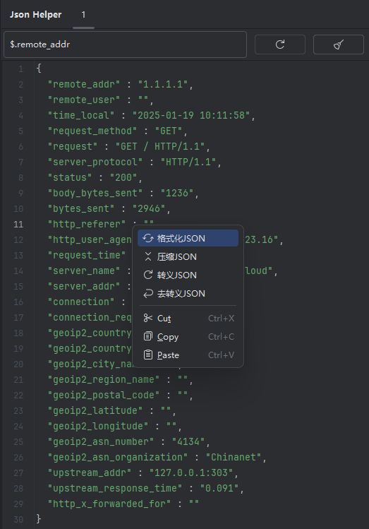
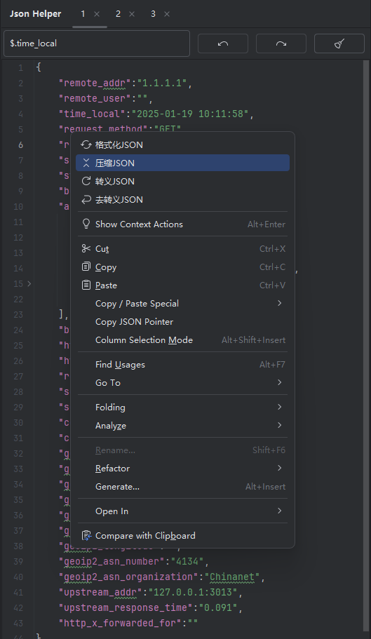
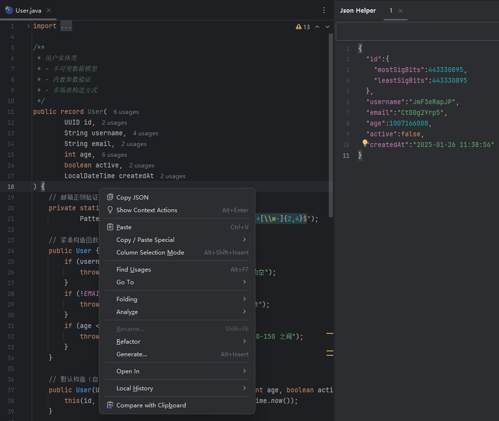

# Json Helper Plugin

Json Helper 用户自由编辑 JSON 数据以及从Java类中复制 JSON 数据，支持强大的查询语言 JsonPath
，帮助用户高效检索和处理JSON信息，提升开发和调试的便捷性。

## 运行环境

- **JDK**: 21 或更高稳定版本
- **Gradle**: 8.12 或更高版本
- **IntelliJ IDEA**: 2023.1 或更高版本

## 预览





## 项目结构

```plaintext
├── src
│   └── main
│       ├── java
│       │   └── com
│       │       └── acme
│       │           └── json
│       │               └── helper
│       │                   ├── core
│       │                   └── ui
│       └── resources
│           ├── icons
│           ├── messages
│           └── META-INF
```

- **core**: 包含插件的核心功能实现，如 JSON 格式化、压缩、转义、去转义、搜索等。
- **ui**: 包含插件的用户界面实现，如工具窗口和菜单。
- **icons**: 存放插件的图标资源。
- **messages**: 存放插件的多语言资源文件。
- **META-INF**: 存放插件的元数据文件。

## 调试步骤

1. **运行插件**:
   ```bash
   ./gradle runIde
   ```
   这将启动一个带有插件的 IntelliJ IDEA 实例，供你测试和调试。

2. **打包插件**:
   ```bash
   ./gradle clean buildPlugin
   ```
   这将生成一个 `.zip` 文件，包含插件的所有资源和代码，直接选择本地安装即可。

## 其他

[IDEA插件图标库](https://intellij-icons.jetbrains.design)
[IDEA插件描述](https://plugins.jetbrains.com/docs/intellij/plugin-dependencies.html#locating-plugin-id-and-preparing-sandbox)

## 贡献

欢迎贡献代码！请遵循以下步骤：

1. Fork 项目。
2. 创建你的分支 (`git checkout -b feature/YourFeatureName`)。
3. 提交你的更改 (`git commit -m 'Add some feature'`)。
4. 推送分支 (`git push origin feature/YourFeatureName`)。
5. 创建一个 Pull Request。

## 许可证

本项目采用 [MIT 许可证](LICENSE)。