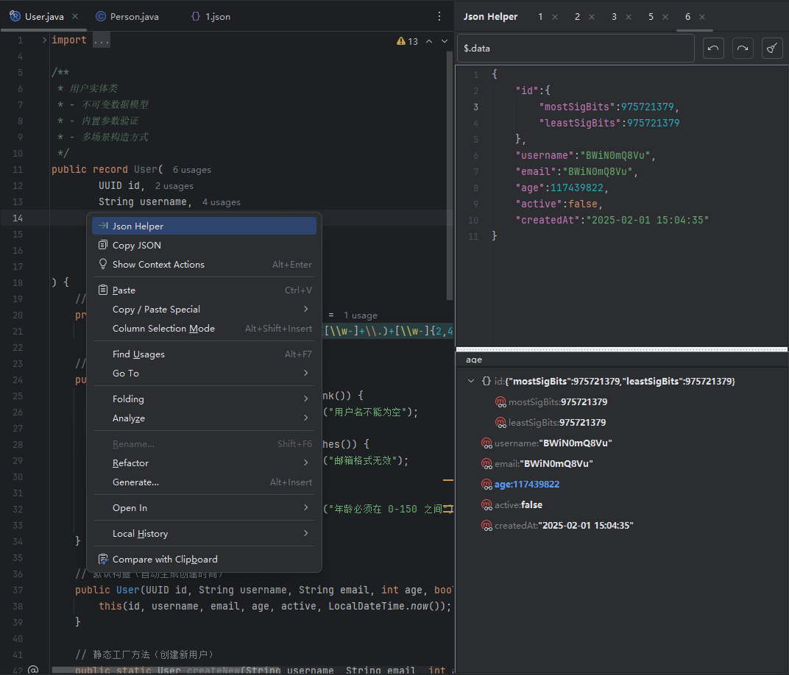
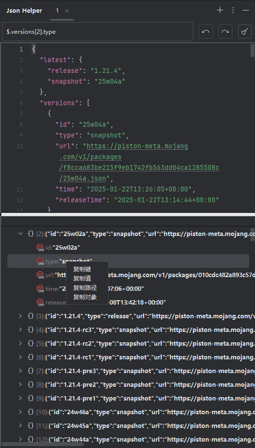
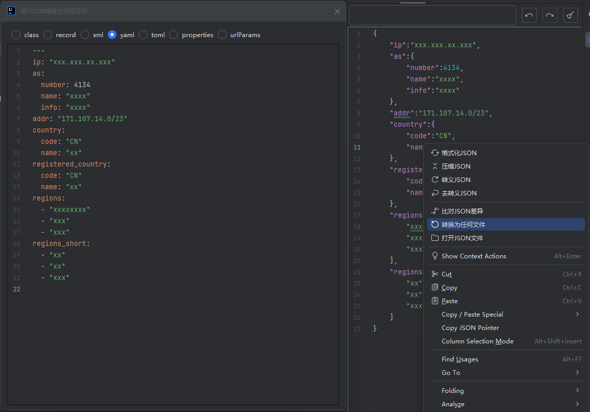

# Json Helper Plugin

Json Helper 是一款强大的 IntelliJ IDEA 插件，支持用户自由编辑 JSON 数据、从 JSON 数据生成 Java 类以及从 Java 类复制 JSON
数据，还支持通过 JsonPath 进行高效查询和处理。[更多细节](https://deepwiki.com/fc6a1b03/json-helper)

## 运行环境

- **JDK**: 21 或更高稳定版本
- **Gradle**: 9.0 或更高版本
- **IntelliJ IDEA**: 2023.1 或更高版本

## 预览







## 调试步骤

1. **运行插件**:
   ```bash
   ./gradle runIde
   ```
   这将启动一个带有插件的 IntelliJ IDEA 实例，供你测试和调试。

2. **打包插件**:
   ```bash
   ./gradle clean buildPlugin
   ```
   这将生成一个 `.zip` 文件，包含插件的所有资源和代码，直接选择本地安装即可。

## 其他

[IDEA插件图标库](https://intellij-icons.jetbrains.design)
[IDEA插件描述](https://plugins.jetbrains.com/docs/intellij/plugin-dependencies.html#locating-plugin-id-and-preparing-sandbox)

## 贡献

欢迎贡献代码！请遵循以下步骤：

1. Fork 项目。
2. 创建你的分支 (`git checkout -b feature/YourFeatureName`)。
3. 提交你的更改 (`git commit -m 'Add some feature'`)。
4. 推送分支 (`git push origin feature/YourFeatureName`)。
5. 创建一个 Pull Request。

## 许可证

本项目采用 [MIT 许可证](LICENSE)。