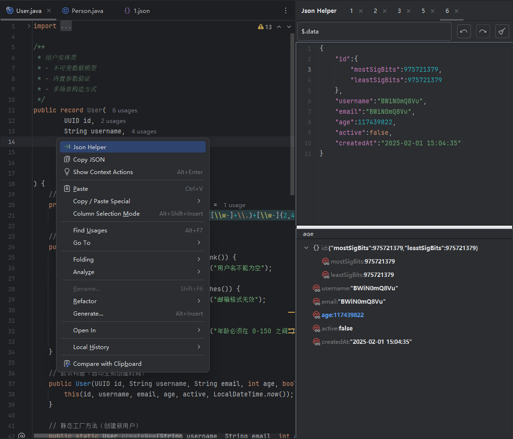
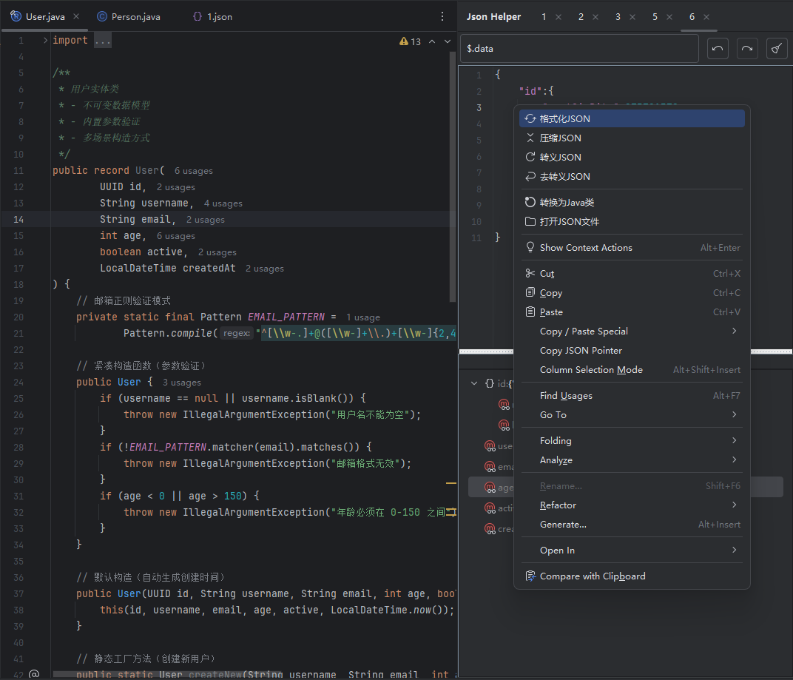
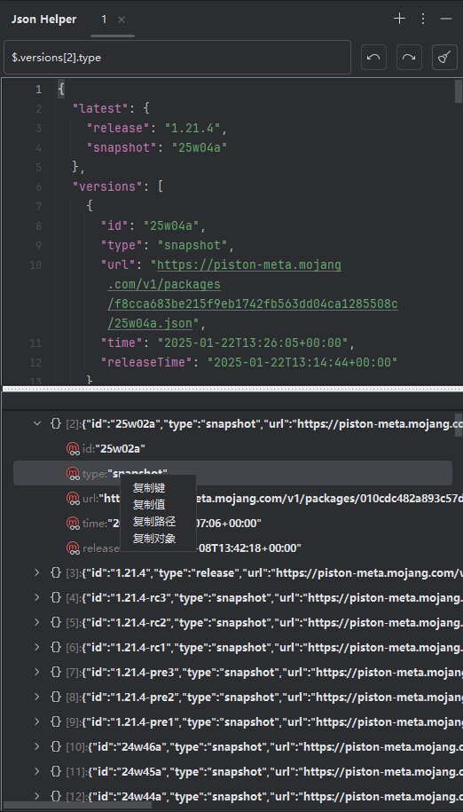
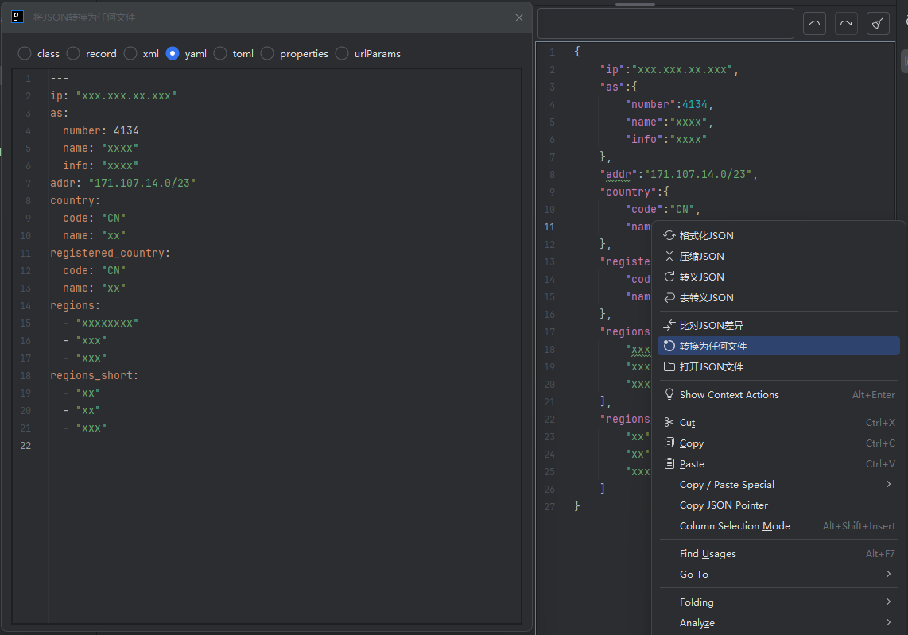

[](https://deepwiki.com/fc6a1b03/json-helper)
[](https://github.com/fc6a1b03/json-helper/stargazers)
[](https://github.com/fc6a1b03/json-helper/commits)
[](https://www.oracle.com/java/)
[](https://gradle.org)
[](https://www.jetbrains.com/idea)
[](https://github.com/fc6a1b03/json-helper/releases/latest)
[](https://github.com/fc6a1b03/json-helper/actions)
[](LICENSE)

# Json Helper Plugin

Json Helper 是一个面向 IntelliJ IDEA 2026.1 的 JSON 效率插件，当前版本为 `0.13.0`。  
它支持 JSON 编辑、修复、压缩、转义、JsonPath / JMESPath 查询、Java 类与 JSON 结构互转，以及 XML / YAML / TOML / Properties / CSV / XLSX 等格式转换。

## 当前基线

- IntelliJ IDEA: `2026.1`
- Java: `25`
- Gradle: `9.4.1`
- 安装方式: `build/distributions/*.zip` 自定义本地安装
- 插件 ID: `com.acme.json.helper`

## 主要能力

- JSON 编辑、格式化、压缩、修复、转义与反转义
- 从 JSON 生成 Java Class / Record
- 从 Java 类复制 JSON 结构
- JsonPath / JMESPath 查询与树形浏览
- URL、JWT、本地文件路径、Web 路径自动解析为 JSON
- JSON 与 XML / YAML / TOML / Properties / CSV / XLSX / Base64 / URL Params 互转
- Search Everywhere 中的项目搜索与 HTTP 请求文件搜索
- 代码截图复制

## 安装

1. 运行打包命令生成插件 ZIP。
2. 在 IntelliJ IDEA 中打开 `Settings` -> `Plugins`。
3. 点击右上角齿轮按钮，选择 `Install Plugin from Disk...`。
4. 选择 `build/distributions/json-helper-*.zip` 安装。

## 开发与打包

本项目默认使用系统中的 `gradle` 命令，Gradle 版本固定为 `9.4.1`，Java 编译与运行环境固定为 `25`。

```bash
gradle printAllVersions
gradle runIde
gradle clean buildPlugin
gradle verifyPluginProjectConfiguration verifyPluginStructure
```

打包完成后，插件 ZIP 位于：

```text
build/distributions/json-helper-x.x.x.zip
```

## 预览







## 项目结构

```text
src/main/java/com/acme/json/helper
├── common
├── core
│   ├── editor
│   ├── json
│   ├── notice
│   ├── parser
│   │   └── converter
│   ├── screenshot
│   ├── search
│   └── settings
└── ui
    ├── action
    ├── dialog
    ├── editor
    ├── panel
    └── search
```

## CI / Release

GitHub Actions 工作流 [build_jar.yml](.github/workflows/build_jar.yml) 已适配当前基线：

- 固定 `Java 25`
- 固定 `Gradle 9.4.1`
- 构建 `buildPlugin`
- 校验 `verifyPluginProjectConfiguration` 与 `verifyPluginStructure`
- 上传 ZIP 工件并创建 GitHub Release

## 贡献

1. Fork 项目
2. 创建分支 `git checkout -b feature/your-feature`
3. 提交修改
4. 推送分支
5. 发起 Pull Request

## License

MIT